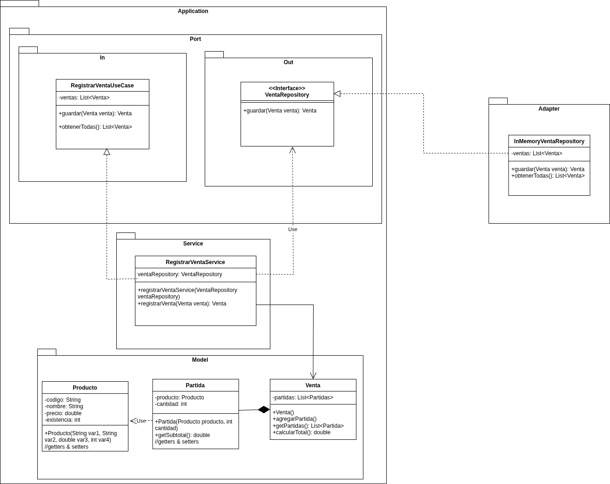

## Justificación de Arquitectura de la Actividad P05 y Explicación de Diagrama UML
El objetivo de utilizar el patron de arquitectura hexagonal es proteger las reglas de negocio (el modelo de ventas) de los detalles de almacenamiento e infraestructura

## Diagrama de dependencias: 

## Decisión y justificación 
Al realizar la ingeniería inversa las modificaciones de Alessandro para realizar el diagrama UML se esclarecio la estructura del proyecto y se detectaron estos cambios: 

-En nuestro paquete de ports, especificamente el puerto de salida es el que define una necesidad tecnológica a nivel externo del núcleo. En este caso la necesidad externa que se define es la necesidad abstracta de persistir una venta.

-Para satisfacer la necesidad de guardar en memoria las ventas realizar, en el paquete adapter del exterior del núcleo se implemento la clase InMemoryVentaRepository que implementa la interfaz VentaRepository y guardar en memoria las ventas a través de la librería java.util.List

-Se definio un servicio RegistrarVentaService. A este servicio se le inyecta una dependencia de tipo VentaRepository  además de implementar a la interfaz RegistrarVentasUseCase. 

## Consecuencias:
Como resultado tuvimos un sistema con un bajo acoplamiento, ya que si en un futuro se llega a cambiar la clase InMemoryVentaRepository para que realice ventas persistentes por medio de SQL. No se ve a tener que tocar absolutamente ni una línea de código dentro del núcleo. 
Además de esto, tenemos una separación de responsabilidades muy bien definida que cumple con los principios SOLID.  
